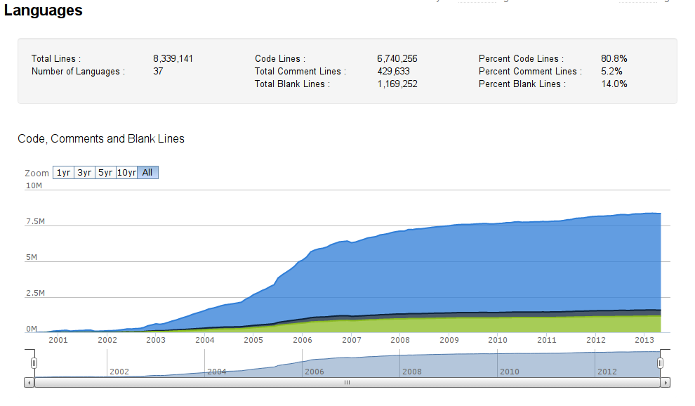
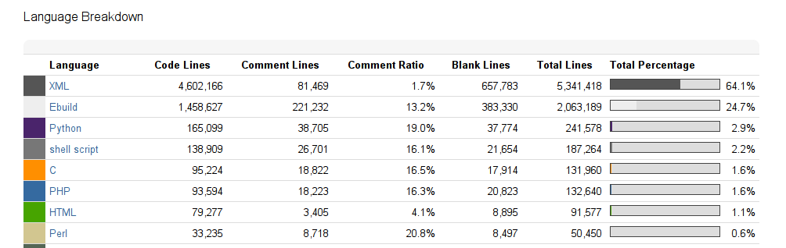
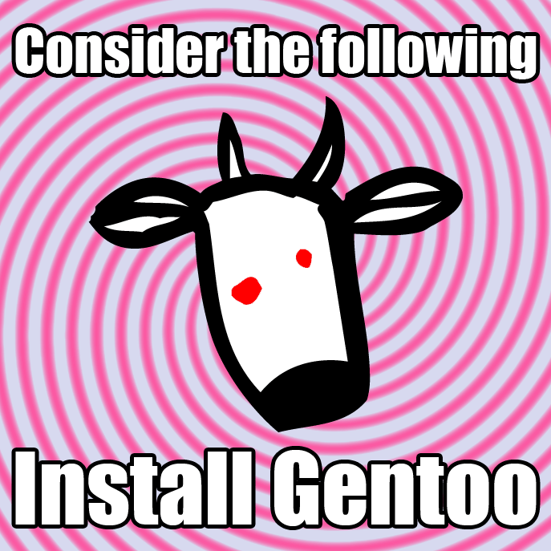

自己紹介
=========

---

Alice Ferrazzi
---------

**前Gentoo時代**  
- イタリアに生まれた  
- 2000/1 パソコンを買って（PentiumIII　８００mhz）。
- インタネットがなかった上でms-dosのOSがありました。
- 2003 adsl modemを買ってとwindowsMeをインストルをさせました。
2004 windowsMe代わりにwindosxp
2005 パソコン雑誌のCDでlinuxを始めて。
mandrivaをインストルしましたけどUSB modemのせいでインタネットを動かなかった。
http://www.flashtux.org/index.php(weechatのdeveloperです。)をやってみましたけどカーネルのいろいろの問題がありました。
http://eciadsl.flashtux.org/download.php
2006大学校をはじめて、先輩はdebian developerですからdebianに興味をもってた。
2009 debian womenに参加しましたとabr2gbr packageのmaintainerになった。
http://www.debian.org/women/profiles/alice
scriptingを始めた。難しいでした。一晩難しいことは色々のdebianルールがありました、とdebianのドキュメントが長かった。
でもdebianのmaintainerになったとdebianQAもやりました。
https://wiki.debian.org/Teams/unknown-package
でもそれでDebianのイタリア人があまり手伝ってくれなかった。
それもDebianのpackageとDebianのQAチームがあまり勉強をなりなかった。
から2011 Gentooのインストルをやってみた、二日（ふつか）でインストルのせいでコンパイルをしました。
一日でGentooを壊しちゃった。。。
USE FLAGが無かった。。。
でも２０１２日本に来ました、ミラクルリナックスでアルバイトとして仕事を始めたのおかげで色々のパソコン言語を学びましたから2013も一回Gentooのインストルをやってみた、今回はとても簡単と思ってた。それとも勉強になりました。色々のflexibilityができるとコンパイルとパッチを使います簡単になります。
例：
ebuild unpack foo-1.ebuild
とここでパッチを追加：
/etc/portage/patches/app-bar/foo

あなたも興味を持ってならここに見てください：
https://wiki.gentoo.org/wiki/Contributing_to_Gentoo

---

Difficicult?!?
---------

**Amazing documentation is just waiting:**  
  
- http://wiki.gentoo.org/wiki/Installation  
- http://wiki.gentoo.org/wiki/Complete_Handbook  
  
**You are already learning how to use, maintain and *contribute*!**  
  
- you always have the option of testing it before in a virtual machine or Containers  
(virualbox, kvm, xen, LXC and BHyVe?) is your friend!  

---

Freedom of choice
--------

- you can choose what to install and how to install it  
**You don't like some of the decision of Gentoo?**   
- you can make your own overlay using any of your favorite vcs (Version Control System)  
- or fork a complete distribution (like Funtoo)  
http://funtoo.org

  

---

How to contribute
--------

*Easy to contribute*  
- Community  
- Bugs  
- Package Maintenance  

---

Community
-------

*Good and Fast Support*    
- Forum  
- IRC Channel  
- Mailing lists  
- wiki (please help with the Japanese Translation )  

---

Bugs
------

- Contributing in **Bugzilla**  
Good response, Simple and efficent. You don't have to lose time writing hundred of mail!  

- Bugday  
http://bugday.gentoo.org/  
next bugday: 2013/November/2  
Bugday is a monthly online event that takes place every first Saturday of every month in #gentoo-bugs in the Freenode network.
---

Package Maintenance
-------

- Report new packages and version bumps at our bugzilla.  
- Make your own Layman repository on github! 
I did it and is amazing!  

---

Staffing Needs
------

http://wiki.gentoo.org/wiki/Project:Gentoo/Staffing_Needs

---

Lines of code
--------
 

---

Language
-------

---

Install Gentoo!
---------

---

Question?
========

---

Slide Url:
========

- https://github.com/aliceinwire/JoinGentoo  

---
My Email:
=========
- alice.ferrazzi@gmail.com

